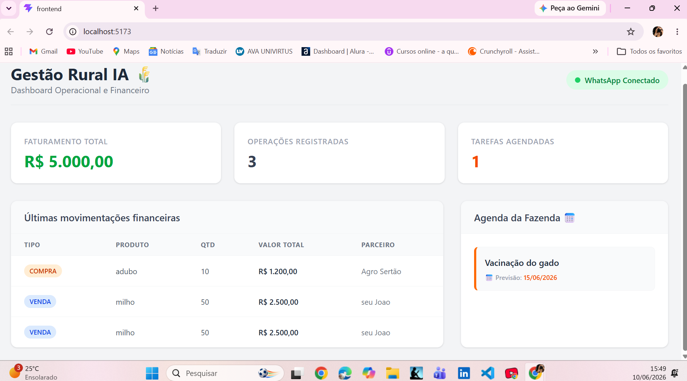
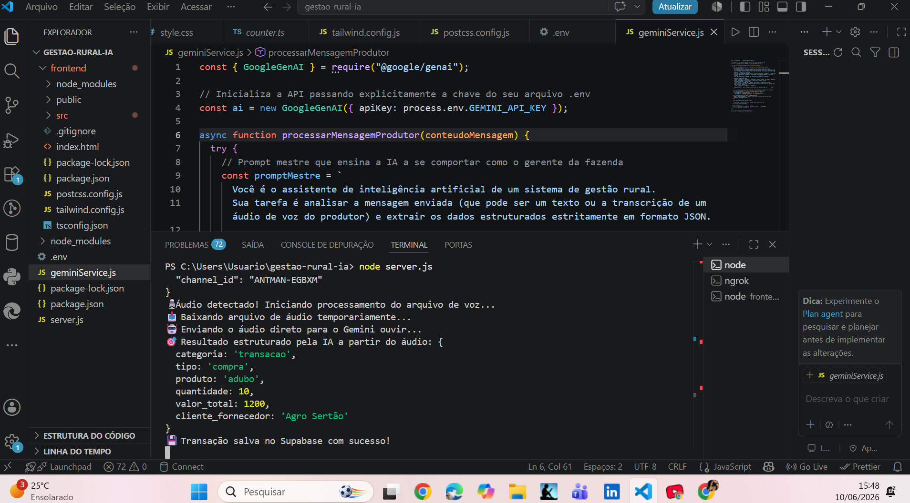

# Gestão Rural IA 🌾🤖

Um SaaS (Software as a Service) multimodal desenvolvido para revolucionar o gerenciamento operacional e financeiro de propriedades rurais. O sistema permite que o produtor rural gerencie sua fazenda direto do campo usando apenas mensagens de texto ou **mensagens de voz (áudio)** via WhatsApp.

---

## 📸 Demonstração do Painel

### Interface Operacional e Financeira

  
  
<em>Dashboard moderno exibindo faturamento total, operações financeiras e a agenda de tarefas da fazenda em tempo real.</em>

### Inteligência Artificial Multimodal em Ação (Processamento de Áudio)

  
  
<em>Logs do backend mostrando o fluxo completo: detecção do áudio, download do arquivo, interpretação pela Gemini API e salvamento no Supabase.</em>

---

## 🚀 Funcionalidades Principais

* **Interface Multimodal (Voz e Texto):** O backend faz o download dos áudios (`.ogg`) gravados pelo produtor e os envia diretamente para a API do Gemini.
* **Processamento Inteligente com IA:** Utiliza o modelo `gemini-2.5-flash` para ouvir os áudios ou ler os textos, interpretar o contexto do agronegócio e estruturar os dados automaticamente em formato JSON.
* **Módulo Financeiro:** Identifica compras e vendas de insumos, animais ou produtos, calculando o faturamento total em tempo real.
* **Módulo Operacional (Agenda da Fazenda):** Captura agendamentos de tarefas (ex: *"vacinação do gado para amanhã"*) e calcula automaticamente as datas previstas.
* **Persistência em Nuvem:** Integração direta com o Supabase para armazenamento seguro dos dados estruturados.

---

## 🛠️ Tecnologias Utilizadas

### **Backend**
* **Node.js** + **Express** (Construção do servidor e rotas de Webhook)
* **@google/genai** (API oficial do Gemini para inteligência artificial multimodal)
* **@supabase/supabase-js** (Persistência e gerenciamento do banco de dados relacional)
* **Axios** (Download dos arquivos de mídia binária do WhatsApp)

### **Frontend**
* **React** + **TypeScript** (Interface dinâmica e tipagem forte)
* **Vite** (Build tool ultra-rápido)
* **Tailwind CSS v4** (Estilização moderna, limpa e totalmente responsiva)

---

## 🛡️ Práticas de DevSecOps Aplicadas

* **Segurança de Credenciais:** Mascaramento total de variáveis de ambiente e chaves privadas usando arquivos `.env` protegidos por regras rigorosas de `.gitignore`, impedindo o vazamento de chaves de API na nuvem pública.